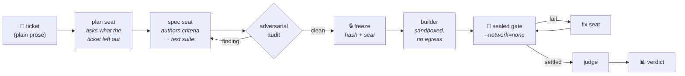

# agent console

**You write a ticket in plain English. An agent builds the software. Then an acceptance suite the agent was never allowed to see decides whether it actually works.**

Most "AI builds your app" demos grade themselves. The model writes the code, the model writes the tests, the model announces success. This project exists to remove the model from that last step.

---

## The problem

An LLM asked *"did you finish?"* will usually say yes. It will say yes when it has stubbed a function, when it has written a test that asserts nothing, and when it has quietly redefined the task into something it could complete.

So the interesting question is not *can a model write code* — it plainly can. The question is:

> **How do you find out whether the thing it built does what you asked, without asking it?**

---

## The approach: held-out acceptance

Before any code exists, a **spec seat** reads your ticket and writes an acceptance suite from the ticket alone. That suite is split in two and **sealed**:

| half | who sees it | what it does |
|:--|:--|:--|
| **visible** | copied into the builder's workspace | lets the builder check its own work as it goes |
| **held-out** | never leaves the vault | **decides the verdict** |

The builder gets the ticket and the visible half. It never sees the held-out half — not in its prompt, not on disk, not through a tool call. Two independent layers enforce that: an OS-sandbox read denial and a policy-tier permission rule. Both were verified by disabling one and confirming the other still refused.

When the build finishes, the artefact is scored in a **sealed container**: `--network=none`, egress verified denied from inside the container on every run, the only route out a per-run budget proxy that answers `401` to anything unauthenticated.

The gap between *"passed the tests it could see"* and *"passed the tests it could not"* is the measurement. That gap is overfitting, and it is invisible to every self-report.

---

## The pipeline



Every stage is a separate model call with its own prompt, its own budget line and its own recorded spend. Nothing downstream of the freeze can alter what it is graded against.

---

## What gets measured

Two **co-primary** metrics, and the second is the one people forget:

```
heldOutPass   the sealed suite passed
falseFinish   the agent declared DONE  ∧  the sealed suite failed
```

`falseFinish` is the number that matters for trust. It counts the times the system was confidently wrong — the mode that, in a product, ships a broken feature to a customer who was told it was ready.

Also recorded per run: token spend by seat, wall-clock by phase, criteria met by tier (`BLOCKING` / `FUNCTIONAL` / `QUALITY`), inferred-vs-stated criteria, and a full authoring trail of every audit finding the spec seat had to answer.

---

## The engineering rule this codebase is built around

> **A check that can only observe success is not a check.**

It is the defect this project keeps finding in itself, and the discipline that grew out of it:

- **Every probe has a negative control.** A test that fires on the bug must be shown to go *silent* when the bug is removed — one broken conjunct at a time. Deleting a file and watching a finding disappear proves nothing.
- **Every contract between two seats is bound by a test.** Where two independently-prompted agents must agree on a literal, that literal has one source and a test that pins both ends. A string-match assertion is not a binding.
- **Claims are measured, not reasoned.** Comments in this tree cite the run id and the file:line that established them. Where something is unverified, it says so.

A worked example, from the commit history: the builder's completion signal is a JSON file with a three-word status vocabulary. The prompt describing it and the reader parsing it lived in different packages, and drifted. The fix was not to correct the wording — it was to render the prompt *from* the reader's own type, and add a test that parses the words back **out of the rendered prompt** and feeds them through the **real reader**. Four mutations, two on each side, all verified to fail.

---

## Status

The pipeline runs end to end unattended. Its first complete run — spec → build → gate ×2 → fix → judge → verdict — took **3h18m with no human at the keyboard**, and returned an *earned* `DID NOT PASS` on a 25-criterion suite.

Post-run forensics on that verdict found that **three of the seven failures were defects in the grader, not the artefact** — including one held-out test that searched for the application's database inside the scorer's own install directory and died before issuing a single request. Those are now fixed, and two new audit rules refuse to freeze a suite carrying either defect class.

That is the honest state: the machine runs unattended, and most of the remaining work is making the grader as trustworthy as the seal already is.

| | |
|:--|:--|
| **Automated tests** | 2,667 across four suites — harness 181, server 1,982, UI unit 224, UI browser 280 |
| **Source** | ~213k lines — TypeScript across the harness, server and UI; Node scripts in `tools/` |
| **Verdict reproducibility** | scorer pinned by image digest; a mid-campaign change refuses to score |

---

## Stack

**Harness** — TypeScript, Node 24, Docker. Suite authoring, freezing, hashing, sealed scoring, budget proxy, spend ledger.

**Dashboard** — Next.js + React front end over a Node API, SQLite for run state, Playwright for browser tests. Live run canvas, per-seat spend, artefact preview, and a supervisor that claims tickets and drives them without supervision.

**Models** — Claude via subscription CLI. No API key is accepted anywhere in the tree.

---

## Running it

Requires **Node ≥ 24**, **Docker**, and a logged-in Claude CLI.

```sh
claude setup-token                  # subscription auth — no API key
cd bakeoff && npm install && npm run build
cd ../dashboard/server && npm install && npm start
cd ../ && npm install && npm run dev
```

Then open **http://127.0.0.1:4319**.

> **It binds `127.0.0.1` and refuses to start otherwise.** Anything that can reach the port can spend your model quota and write files as you.

Full setup, including building the scorer image, is in [`dashboard/README.md`](dashboard/README.md).

---

## Repository map

| path | what lives there |
|:--|:--|
| `bakeoff/` | the harness — suite authoring, audit rules, freeze/seal, sealed scorer, proxy |
| `dashboard/server/` | orchestrator, seats, gate/fix loop, supervisor, API |
| `dashboard/src/` | the console UI |
| `tools/` | replay, repair driver, operational scripts |
| `docs/` | design notes, run post-mortems, and the findings that changed the design |
